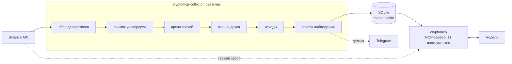
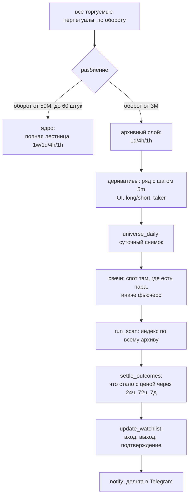
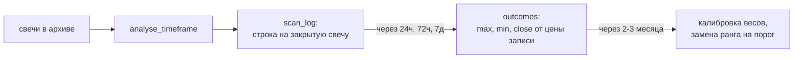
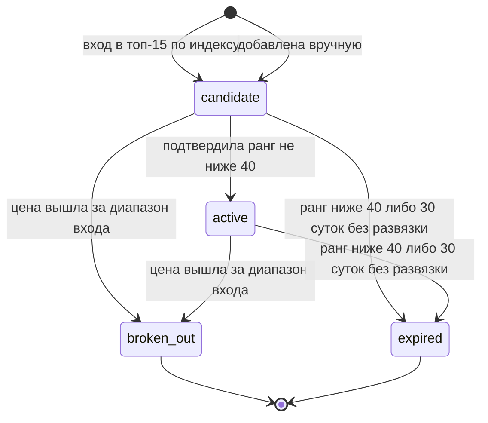
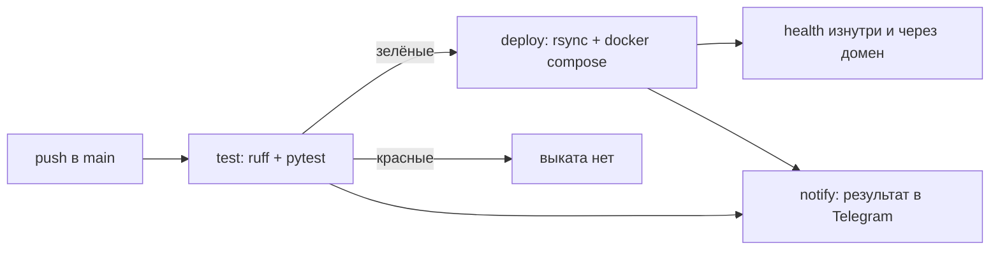

# Архитектура сканера

Как устроен cryptomcp: из чего состоит, что за чем идёт и почему сделано
именно так. Обоснования отдельных решений с замерами — в [PLAN.md](PLAN.md),
здесь общая картина и связи между частями.

Одно допущение проходит через весь проект и объясняет большинство решений:
**агрегаты считает код, структуру читает модель**. Индикаторы, перцентили и
сезонные поправки — детерминированный Python под тестами. Вывод о том, что
происходит на графике, делает языковая модель, которой отдаются числа с базой
сравнения и, когда нужно, сырые свечи. Поэтому в коде нет ни одного правила
вида «если X, то покупать»: система измеряет **готовность к движению, а не его
сторону**.

---

## 1. Два процесса

Сборщик и сервер — **разные контейнеры, а не потоки одного процесса**. Причина
не в нагрузке, а в разных режимах отказа:

| | сервер | сборщик |
|---|---|---|
| Промолчал час | никто не пострадал, следующий вопрос обслужен | потерян час открытого интереса **навсегда** |
| Что делает | отвечает, ничего не копит | копит, ни на что не отвечает |
| Доступ к архиву | только чтение | единственный писатель |
| Своя база | `watchlist_manual.sqlite` — ручные записи списка | — |
| Смотрит наружу | да, порт за Caddy | нет, портов не публикует |
| Знает токен | да | нет |

**Строка «своя база» — не исключение из инварианта, а его граница.** Инвариант
«сервер не пишет» защищает невосстановимые деривативы: сборщик, упавший из-за
ошибки в обработке чужого запроса, теряет час открытого интереса навсегда. К
ручной записи в список наблюдения это отношения не имеет, и вместо того чтобы
ослаблять инвариант, базы разведены физически. `market.sqlite` пишет только
сборщик; `watchlist_manual.sqlite` пишет только сервер; читают оба. Конкуренции
за запись нет ни в одном файле, поэтому не нужны ни `busy_timeout`, ни
согласование с часовым прогоном (PLAN §4.28).

Асимметрия в первой строке — главная. Раздел `/futures/data/` у Binance отдаёт
открытый интерес, соотношения long/short и долю тейкер-покупок **только за
последние 30 суток**, дальше HTTP 400 с кодом −1130. Свечи и фандинг, наоборот,
докачиваются за годы в любой момент. Значит сборщик, упавший вместе с сервером
из-за ошибки в обработке чьего-то запроса, стоил бы невосстановимых данных — и
поэтому падать вместе им нельзя.

Тот же принцип внутри сборщика определяет **порядок шагов**: деривативы
первыми, свечи последними. Если прогон оборвётся на середине, потеряно будет
самое дешёвое.

---

## 2. Часовой прогон

Порог архивного слоя — **3M оборота, а не 10M** (с 03.09.2026). Замер того дня:
231 монета против 121, и пятнадцать из топ-20 по индексу на 4h — из полосы
3–10M, которой архив не видел вовсе. Ниже 2M не идём: там стакан тонкий, доля
тейкер-покупок считается по десяткам сделок, и метрики шумят.

Новые символы впускаются **не более 25 за прогон**. Понижение порога приводит
сотню незнакомых монет разом, и первый же прогон попытался бы взять по каждой
30 суток деривативов плюс лестницу свечей — залп в тысячи запросов. Растягивание
ничего не стоит: окно деривативов у новичка начинается от границы доступных
30 суток, а не от момента приёма, поэтому впущенный через пять часов получит ту
же историю.

Шаг деривативов идёт **по всему архивному слою, а не по ядру**. Это стоит
0.6 ГБ в год и было решено замером: из топ-15 по индексу восемь монет имели
оборот ниже порога ядра, то есть больше половины кандидатов в список наблюдения
оставались без открытого интереса — а признаки накопления считаются именно по
нему. Полоса 10–50M и есть самая интересная для сжатий.

Шаг ряда деривативов — **пять минут, а не час**. Агрегировать до часа можно в
любой момент, восстановить час до пяти минут — никогда. Именно эта детализация
показала на CAKE, что суточная разгрузка OI на 8% — одно событие в 20:00, а не
равномерный фон.

**Один упавший символ не отменяет прогон.** Что не собралось, попадает в
`collector_runs` строкой ошибки, остальное пишется. Молчащий сборщик снаружи
неотличим от работающего, поэтому каждый прогон обязан оставить след; на этом
же построен healthcheck контейнера — «был ли прогон за последние два интервала».

---

## 3. Как считается индекс

`squeeze_index` — свёртка четырёх групп признаков, каждая в диапазоне 0…1
(версия формулы v5, §4.33 плана).

| Группа | Вес | Что меряет |
|---|---|---|
| `volatility` | 0.35 | BBW(20,2) и ATR%/цена, оба перцентилем по своей истории |
| `range` | 0.25 | ширина диапазона Дончиана(20) перцентилем по своей истории |
| `volume` | 0.20 | объём против **сезонной** базы того же слота суток |
| `duration` | 0.20 | длительность текущего сжатия перцентилем среди ЗАВЕРШЁННЫХ серий этой пары |

Объёмный профиль (`value_area`) и дивергенции RSI (`divergence`) весили по 0.10
и убраны из свёртки: первый обнулялся ровно тогда, когда цена подходила к
границе диапазона, и давал максимум за широкий профиль; вторая была плоской
единицей у пяти монет подряд, потому что RSI выходит из перепроданности
механически. Вместе они давали «бесплатный пол» индекса 0.33. Обе метрики
остались в выдаче справкой — разделами 4 и 5 `get_squeeze_metrics`.

Три свойства этой свёртки важнее самих весов.

**Ни одно число не печатается без базы сравнения.** Перцентиль требует и не
менее 60 наблюдений, и не менее 60 суток охвата одновременно. Не хватило —
печатается причина, а не значение.

**Группа без базы исключается из индекса, а не обнуляется**, и веса оставшихся
перенормируются. Ноль означал бы «признака нет», хотя его просто не удалось
измерить, — а свежие листинги как раз целевая категория сканера.

**Узость меряется перцентилем по истории самой монеты, а не абсолютным
порогом.** Абсолютные пороги из исходного ТЗ (6–8% по таймфреймам) на живом
рынке не срабатывали ни у кого: медианный дневной диапазон рынка 65%. Четверть
веса формулы простаивала как премия за то, что инструмент не криптовалюта.
Единый порог для BTC и для свежего листинга бессмыслен так же, как единый
множитель объёма.

Веса **стартовые и не откалиброваны**. Заменить их можно будет, когда
`outcomes` наберут два-три месяца; до тех пор любое число было бы угадыванием.

---

## 4. Журнал скана и исходы

Скан **не делает ни одного запроса к бирже**: свечи уже в базе, а перцентилям
хватает её глубины. Поэтому его не жалко гонять каждый час по всему универсуму.

**Одна строка на закрытую свечу и версию формулы** — обеспечено уникальным
индексом в схеме, а не проверкой в коде, чтобы нельзя было обойти по
невнимательности. Сканер ходит раз в час, четырёхчасовая свеча закрывается раз
в четыре: без ограничения одно и то же наблюдение попало бы в статистику
четырежды и перевесило бы дневное.

Отсюда следствие, о которое легко споткнуться: **строка не переписывается**
(`INSERT OR IGNORE`). Колонка, добавленная сегодня, у вчерашних записей
останется пустой навсегда. Это не сбой, а цена идемпотентности; проверять новую
колонку надо на записи, сделанной после выкладки.

`formula_version` входит в ключ. При любом изменении формулы или глубины
входного ряда версию **обязательно поднимать**: иначе несколько часов ранги
считались бы по смеси двух поколений, и накопленное обесценится.

Исход меряется по **High/Low внутри периода, а не по закрытию**: цель, которую
цена достала и с которой откатилась, по закрытию не засчиталась бы вовсе.

---

## 5. Список наблюдения

**Отбор рангом, а не порогом.** Измерено на 58 ликвидных монетах: порог индекса
0.5 не пропускал никого, 0.4 — четверых, 0.3 — треть рынка. Естественной
границы между ними нет, и взять её сейчас неоткуда. Любое число было бы
угадыванием, и через месяц выяснилось бы, что сканер месяц молчал или месяц
шумел. Ранг самонормируется: при общем сжатии рынка список не переполняется,
при расширении не пустеет.

**Гистерезис.** Вход в топ-15, выход из топ-40. Одинаковые пороги заставляли бы
монеты у границы входить и выходить на каждом прогоне.

**Порядок проверок при закрытии важен: пробой раньше ранга.** Монета, которая
выстрелила и на этом вылетела из топа, должна попасть в статистику как
сработавшая, а не как «выпала по рангу», — иначе журнал систематически терял бы
именно удачные случаи.

**Эпизод, а не строка на пару.** Монета попадает в список не раз в жизни;
затирать прошлый эпизод новым значило бы стирать ровно ту историю, ради которой
список и ведётся. Открытый эпизод на пару может быть только один — это
частичный уникальный индекс в схеме.

Ручные записи (`entered_by = 'manual'`) по рангу не выбывают: сканер видит
только то, что умеет измерять.

**Трое ворот на вход, помимо ранга (§4.35 плана).** Ход цены за сутки не выше
15% — монета в движении не кандидат на накопление; длительность сжатия не
меньше семи суток — сканер ищет недельные и месячные базы, а не полуторадневные;
и пол по индексу, заведённый параметром, но пока выключенный (значение
выбирается замером, а не сегодняшним ощущением). Ворота стоят ТОЛЬКО на вход:
индекс со всеми группами считается и пишется в журнал по всем монетам, включая
отсеянные, — иначе нечем будет проверить сами пороги.

Список ведётся на 1d. На 4h и 1h индекс считается и пишется в журнал, но
эпизодов не открывает. Довод общий — лишний ТФ поднимает потолок списка на 40
эпизодов, — и к нему добавлен измеренный: окно ширины на 4h равно 3.3 суток,
оно проезжает внутри месячного боковика, и серии длиннее нескольких суток там
почти не выживают. Эпизоды на 4h открывались по величине, которая на вопрос
задачи не отвечает. Уже открытые эпизоды 4h доживают своим чередом.

---

## 6. Уведомления

Два независимых канала в одну группу Telegram.

| Отправитель | Когда | Что шлёт |
|---|---|---|
| `notify.py` из сборщика | состав списка изменился | вошли, подтверждены, вышли |
| работа `notify` в CI | пуш в `main` | результат тестов и выката |

У обоих одно правило: **доставка не должна ронять того, кто её вызвал**.
Уведомление отправляется только после `con.commit()` и не поднимает исключений
ни при каком ответе сети. Цена ошибки несимметрична: недоставленное уведомление
не стоит ничего, дельта остаётся в базе и в логе, — а прогон, упавший на
отправке, теряет час открытого интереса навсегда.

**Молчание, когда сказать нечего.** Прогон идёт каждый час, состав списка
меняется куда реже. Ежечасное «изменений нет» превратило бы канал в шум,
который перестают читать, и настоящий вход в нём потерялся бы.

Повтор только на 5xx: 400, 401 и 403 — это конфигурация (не тот токен, бот не в
группе), повтор её не исправит, а задержит прогон.

---

## 7. Как отвечает сервер

Три уровня выдачи; модель идёт сверху вниз и останавливается, как только хватит.

| Уровень | Инструмент | Когда нужен |
|---|---|---|
| L1 | `get_market_snapshot` | общая картина по лестнице ТФ |
| L2 | `get_squeeze_metrics` | признаки сжатия с базой сравнения: четыре группы индекса и две справочные |
| L3 | `get_klines` | форма: последовательность экстремумов, отбои от уровня |

Плюс `get_key_levels`, `get_derivatives`, `scan_pairs`, `list_symbols`,
`get_watchlist`, `get_scan_history`, `add_to_watchlist` и
`remove_from_watchlist`. Каждый работает и по фьючерсам, и по споту:
перпетуал ценово производен от спота, и когда открытый интерес мал, а сигналы
шумные, подтверждение объёмом честнее искать там, где происходит поставка.

**История берётся из архива, свежий хвост — всегда с биржи.** Сборщик ходит раз
в час; отдавать выдачу целиком из базы значило бы иногда отставать на час.
Исключение — `scan_pairs` без явных пар и `get_watchlist`: они сознательно
читают журнал, потому что пересчёт стоил бы запроса на каждый символ, и в
выдаче печатается, по какую свечу данные закрыты.

**Ряд, который видят метрики, всегда одной длины** — столько свечей, сколько
требуют правила перцентилей, независимо от источника и запрошенного `limit`.
Без этого один и тот же символ получал разные числа в разных инструментах.

**Незакрытая свеча отсекается на входе, в `series.py`**, так что ни один
индикатор физически не может её увидеть: её объём и диапазон неполные, поэтому
любая метрика поверх смещена.

**Составной инструмент возвращает частичный результат, а не отказ.** Нехватка
истории на одном таймфрейме не отменяет остальные.

Имена параметров совпадают по всем инструментам, и это не косметика: модель
аргументов собирается без `extra="forbid"`, поэтому незнакомый ключ не вызывает
ошибки — он молча исчезает, и инструмент отвечает по умолчанию правдоподобно
выглядящим, но не тем ответом. Тест обходит схемы всех инструментов и требует,
чтобы у параметра во множественном числе был близнец в единственном.

`get_order_book` добавляет живой L2-снимок: сырые уровни и агрегаты глубины
считаются от середины той же книги, а отдельный last price помечен другим
моментом. Пять инструментов сессии наблюдения дают ограниченную во времени
последовательность REST-снимков, diff внутри пересечения ценовых окон и
сырые `aggTrades`. Сводка различает устоявшую, исполненную и снятую
ликвидность; пропуск trades даёт `n/a`, а не догадку об отмене. Тикер
принадлежит процессу сервера, поэтому рестарт делает сессию молчащей — это
явно видно в списке, а не маскируется под работающую.

---

## 8. Хранилище

| Таблица | Что хранит | Восстановима? |
|---|---|---|
| `derivatives` | ряд 5m: OI, long/short, taker ratio | **нет**, у биржи 30 суток |
| `funding` | ставки фандинга | да, биржа отдаёт за годы |
| `ohlcv` | свечи: 1w и 1d 5 лет, 4h 3 года, 1h 2 года | да |
| `universe_daily` | суточный снимок оборотов и OI | нет, копится с первого дня |
| `symbols` | дата листинга, рынок-источник | да |
| `scan_log` | индекс и все компоненты на закрытую свечу | пересчитывается из `ohlcv` |
| `outcomes` | что стало с ценой на трёх горизонтах | пересчитывается |
| `watchlist` | эпизоды наблюдения | **нет**, история решений сканера |
| `collector_runs` | след каждого прогона | нет |

SQLite в именованном томе Docker — томе, а не папке проекта: деплой
синхронизирует `/opt/cryptomcp` с `--delete`, и база в рабочей папке стиралась
бы при каждом выкате.

OAuth живёт отдельно в `oauth.sqlite`, в своём именованном томе. Это важное
исключение из правила «MCP-сервер только читает»: рыночную `market.sqlite` он
по-прежнему не меняет, но записывает регистрации клиентов, одноразовые коды и
токены в отдельную базу. Секретные коды и bearer-токены хранятся там по SHA-256,
а не открытым текстом; client secret нужен SDK для проверки token endpoint и
защищён правами файла и непубличным Docker-томом.

Временные сессии стакана используют третий файл `order_book_watch.sqlite`,
отдельный и от `market.sqlite`, и от OAuth. Сервер записывает снимки и diff,
сырые aggTrades и интервалы пропусков, collector только истекает зависшие
сессии и удаляет все эти строки после retention; WAL и `busy_timeout` защищают
их редкие одновременные записи. Это хранение восстановимо и ограничено сроком,
поэтому его отказ не должен влиять на порядок или надёжность основного часового
прогона.

Источник свечей закрепляется за символом (`symbols.market`), чтобы в одном ряду
не склеились спот и фьючерс. 15m и мельче не хранятся: год пятнадцатиминуток
весит больше всей остальной лестницы, а докачать их можно за один проход.

---

## 9. Развёртывание

Тесты — **ворота выката**: `deploy` объявлен зависимым от `test`, поэтому код с
падающими тестами физически не может попасть на сервер.

Оба контейнера сидят в общей сети `briefgenerator_internal`; наружу смотрит
только общий Caddy, обслуживающий все домены сервера. Caddy-конфиг деплой **не
трогает** — иначе выкат одного проекта затирал бы роутинг соседнего.

**`.env` на сервере перезаписывается каждым деплоем целиком** (`printf … > .env`,
а не дописывание). Переменную, добавленную руками через ssh, сотрёт ближайший
пуш в `main`. Единственный правильный путь для нового секрета — положить его в
секреты GitHub и дописать в тот же `printf`.

Подробности сервера, пользователей и портов — в PLAN §7.

---

## 10. Границы

Не предсказывает направление, не даёт торговых рекомендаций и не умеет
торговать. В проекте нет ни одного API-ключа, а все торговые эндпоинты Binance
требуют подписи: торговые операции невозможны **конструктивно**, а не по
договорённости.

`squeeze_index` — эвристика с неоткалиброванными весами. Её прогностическая
ценность **неизвестна**, пока `outcomes` не накопят статистику; сейчас это
измеритель готовности к движению, а не сигнал.

Все метрики считаются по **закрытым** свечам. Где базы для сравнения не
хватило, стоит `n/a` — это не сбой, а отказ печатать число, которое нечем
подпереть.
